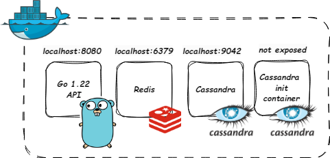

# Caching

  

This project is a simple CRUD build in Go with GET requests responses cached in redis

## Table of contents
* [General info](#general-info)
* [Technologies](#technologies)
* [Setup](#setup)
* [Status](#status)
* [Inspiration](#inspiration)

## General info

Project consists of four containers:

Pic.1 Visualization of project run with docker compose 

## Technologies
* Go 1.22
* Cassandra 3.11.2
* Redis 6.2
* Docker

## Setup
1. Run docker compose: `docker-compose up`
2. API should be accessible from http://localhost:8080

## Status
Project is: _finished_

## Inspiration
For fun
